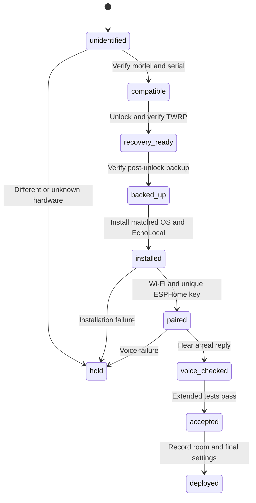

# Acceptance and repeated conversion

These are proposed operating checks, not performance guarantees from EchoLocal.

## Confirmed pilot result

One Echo Dot 2 completed unlock, verified post-unlock backup, Fire OS installation in both slots, EchoLocal installation, Wi-Fi association, and ESPHome pairing. Its first assistant slot used Okay Nabu and a Russian Homeway-backed pipeline.

HA completed an announcement request and the satellite returned to idle. The user then performed the requested wake-word and spoken-command test and confirmed the audible Russian reply “Ready.” This passes the **basic voice test**, including microphone input and physically audible output. The announcement itself was not separately rated for audibility.

The temporary host container and USB proxy were stopped, and HA still reported the satellite available. A software reboot occurred during installation. Cold power cycling, an extended command series, recovery from backup, and a full day of operation have not been tested here.

## Basic handoff checklist

- The physical serial matches the inventory entry.
- Backup decompressed sizes and SHA256 digests match device reads.
- Installed OS/SDK and EchoLocal versions are recorded.
- Wi-Fi connects and the unique API key is stored privately.
- HA's ESPHome integration loads with satellite and speaker entities.
- Assistant and wake word match the intended slot.
- A person hears a reply to a command through the microphone.
- A harmless, reversible entity action is checked separately before claiming smart-home control works.

The last item has not yet been claimed as passed in this pilot.

## Extended acceptance before broader deployment

1. Try 20 representative commands from the intended room. A starting target is 18 correct actions on the first attempt. Include ordinary household noise and record actual results.
2. Measure delay from the end of the utterance to the start of the reply. Record median, p95, and maximum; p95 from 20 samples is a rough estimate. Set targets from observed performance.
3. Check language, room names, aliases, and custom intents. A conversation answer does not prove a particular HA intent is exposed or supported by the agent.
4. Check mute/unmute, Action and volume buttons, LED feedback, and wake-word recovery.
5. Say Stop during replies and music, then issue another command. Confirm playback stops and listening resumes. Upstream [issue #85](https://github.com/ygelfand/echolocal/issues/85) motivates this test; it does not establish failure on every device.
6. Remove and restore power; check Wi-Fi, key persistence, and HA availability. Separately test HA restart, Wi-Fi loss, and any private-route interruption.
7. Use the speaker for a normal day; record false activations, missed requests, and manual recovery.
8. With two satellites, check whether both answer one wake word. Do not assume room arbitration.
9. Record external dependencies. Local wake-word detection does not remove dependence on remote HA or cloud STT/LLM/TTS. Test operation without Amazon connectivity separately if that is a requirement.

Start control tests with a lamp or test script with an easily reversible effect.

## Per-device sequence

This matches the stock pilot: unlock changed the boot chain before full backup access. An already-unlocked speaker may start at a different stage; verify its state explicitly.

Process the first devices one serial at a time. Reuse verified artifacts and instructions, but create a new private directory, asset ID, name, backup, and key for each speaker. Check identity before each write. Never copy one speaker's raw image or PSK across the fleet.

After two or three speakers pass the same process, consider automating inventory and repeatable checks. `--serial` is not proof that parallel bootrom unlocking through a hub is reliable. The seller's unattended batch process was not reproduced. Backup and verification alone took about 20 minutes on the pilot host; no fixed conversion-time promise is made.

## Hold a device when

- Model, firmware, or recovery does not match the selected route.
- USB identity is ambiguous or the connection is unstable.
- Backup is incomplete or a write has an unexplained result.
- The device cannot return to a known recovery/runtime state.
- Pairing succeeds but a real voice command fails.

Preserve logs privately and diagnose the stage before repeating destructive operations. Inventory and HA pipeline work can continue independently.
