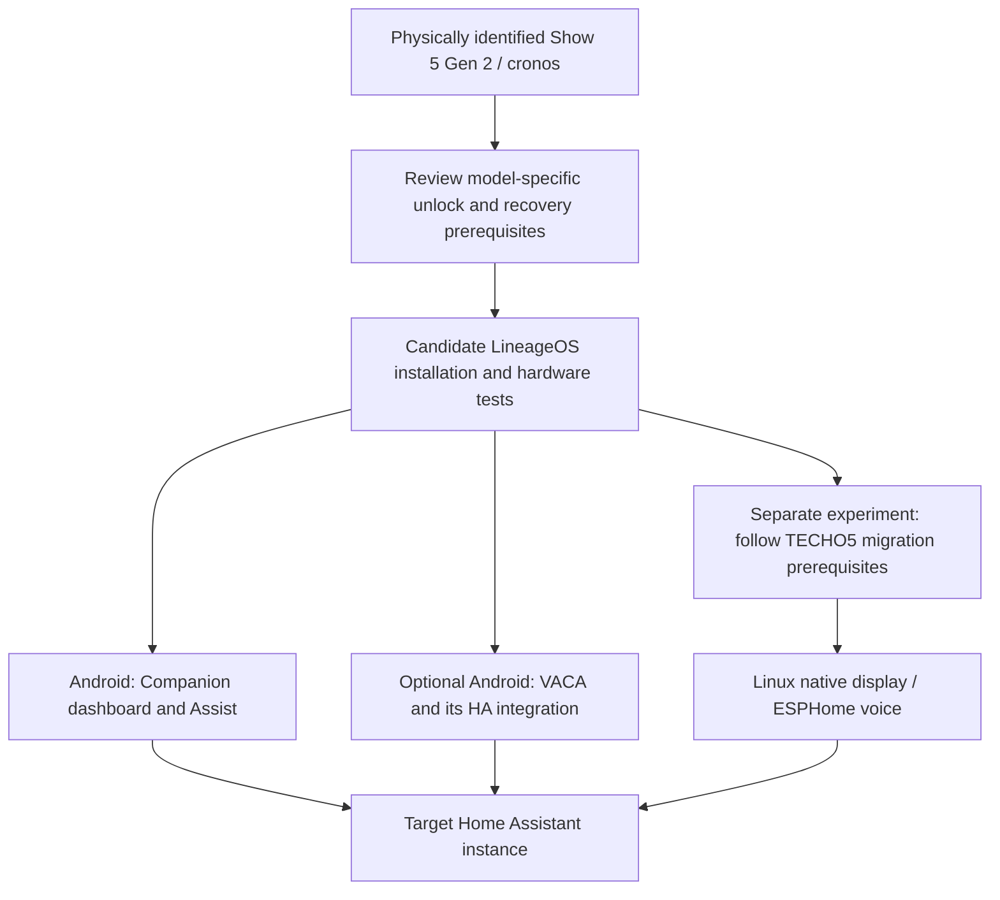

# Experimental appendix: Echo Show 5 second generation

**Status: research only.** This appendix concerns **Echo Show 5 Gen 2 (2021), `cronos`**. It is not the Dot 2 / EchoLocal runbook, and it does not claim that any Show has been unlocked, flashed, restored, or tested by this project.

The underlying research was collected on **2026-10-01 in America/Los_Angeles**, with some recording completed on **2026-10-02 UTC**. Versions cited here are historical reference pins. Recheck the model-specific upstream instructions and release status before a physical trial. No household inventory or Home Assistant addresses are included.

## The two possible outcomes

**Android display:** the researched [LineageOS 18.1 `cronos` v0.4](https://github.com/amazon-oss/releases/releases/tag/lineage-18.1-cronos-v0.4) is an unofficial Android 11 port published on **2026-09-05**. It is a candidate for a conventional Home Assistant dashboard and compatible Android applications. The proposed first client is Home Assistant Companion, beginning with the dashboard and button-triggered Assist. Its [experimental Android wake-word feature](https://www.home-assistant.io/voice_control/android/) makes an additional custom integration optional for that first trial. Actual operation on this ROM still needs testing.

**Dedicated Linux terminal:** the separately researched [TECHO5 v0.9.25](https://github.com/HuskerMinion/techo5/tree/v0.9.25) replaces the Android runtime with Alpine and a dedicated voice/display application. It offers an ESPHome-compatible voice path and its own interface. Its dashboard options include a native renderer for supported cards or a full frontend streamed from a separate dashcast service. It does not run Android APKs.

For an Android goal, evaluate LineageOS first. For a dedicated voice/display goal, compare TECHO5 after reviewing its own prerequisites. These are different runtime choices, not applications to run together. A documented migration between them does not prove a reliable return to factory Alexa.

This diagram describes a proposed evaluation sequence. It is not evidence that any stage has been completed.

## Proposed evaluation checkpoints

The [hardware compatibility guide](hardware-compatibility.md) explains family/generation identification, selection boundaries, and wrong-model consequences. This appendix only evaluates the `cronos` candidate; it does not claim that other generations can never be supported.

1. **Identify the hardware.** Confirm the physical generation, product identifier, and current software state. Keep real serials and asset labels in a private inventory. A Home Assistant device-registry entry is a clue, not sufficient evidence to select an image. Do not substitute `biscuit`, `checkers`, or `crown` files.
2. **Prepare the documented host environment.** The recorded amonet-cronos 2.0.1 instructions specified Windows or Linux, the Show's normal AC adapter, and a micro-USB data cable. The described main route did not require opening a working device. Initial unlocking on macOS or through a VM was not validated here.
3. **Review the selected unlock and recovery sources.** Verify the package and release provenance, understand the destructive stages, and establish the available recovery checkpoints. The 2026-09-11 upstream compatibility statement applied to firmware discussed then; do not turn it into a promise about future updates. The [Android source research](../research/show5-android-sources.md) links the relevant instructions.
4. **Preserve per-device data before the OS wipe.** A complete stock backup before any unlock write was not established. A backup made after unlocking does not reverse the unlock itself. Copy available recovery backups off the device, check them, and keep credentials and calibration data outside the repository. A restore is unproven until it has actually been tested on the selected device.
5. **Evaluate the base Android image.** Follow the exact ROM procedure for the selected version rather than executing this summary as a flashing guide. After boot, test display, touch, Wi-Fi, speaker, microphones, physical camera controls, and camera capture. Installing the ROM removes the previous OS/settings; it does not install or configure a working HA voice client automatically.
6. **Evaluate one HA client.** Start with a small dashboard, then text Assist, button-triggered speech, and experimental hands-free use. Add VACA only if its dedicated display/voice controls are needed, with its matching custom integration and APK. Avoid applications competing for the microphone. Reboot, interrupt the network, and measure recovery before expanding the feature set.
7. **Measure everyday operation.** Record repeated commands, response latency, false activations, performance during music, stop and microphone recovery, mute/unmute, and at least a full day of operation. Evaluate cameras, streaming dashboards, Bluetooth, and music afterward. Successful first boot is not evidence of multi-day audio stability.

## Home Assistant connection model

Home Assistant remains a separate server. Installing Android on the Show does not install Home Assistant Server there. The network requirements depend on the chosen client:

- **Companion:** Show → Home Assistant HTTP(S)/WebSocket and any referenced media URLs.
- **VACA:** Home Assistant → the Show's VACA/Wyoming listener, recorded default **TCP 10800**, plus Show → Home Assistant frontend/media. Use the port actually displayed by the app and the VACA integration.
- **TECHO5:** Home Assistant → **ESPHome TCP 6053** with the device key, plus Show → the configured Home Assistant/media endpoints. Streamed dashboards add Show → dashcast, normally **TCP 9555**.

These defaults come from the historical research, not measurements of an installed system. The [client-options research](../research/show5-ha-options.md) provides source links and additional optional-service requirements. Do not copy one client's ports or authentication setup into another. MQTT and persistent network ADB are not prerequisites for the basic display paths.

Verify the target Home Assistant endpoint from the Show itself, including authentication, DNS, routing, and media delivery. A remote server or cloud STT/TTS still introduces external dependencies even when the wake word runs on the Show. Full operation without internet requires an appropriate local server and speech pipeline; replacing the client alone does not provide it.

## Evidence and open questions

The research established the existence of an unofficial model-specific ROM and relevant application options. It did not establish a successful conversion, complete rollback, or reliable voice service on hardware in this project.

The v0.4 changelog reported camera and long-running-audio fixes, so older blanket claims that the camera never works should not be repeated for that artifact. The recorded limitations still included quiet microphones, Wi-Fi fast roaming, SELinux Permissive, disabled deep sleep, and Mute also serving as Power. Published fixes require physical acceptance checks; the device is not an officially supported modern Android tablet.

Before promoting this appendix into an installation runbook, record a specific model/software combination, verified artifacts, recovery evidence, client/integration versions, and measured acceptance results. Until then, keep Show 5 work separate from the primary Dot 2 pilot.

Related documents: [Android sources and limits](../research/show5-android-sources.md), [HA client comparison](../research/show5-ha-options.md), and [Echo ecosystem research](../research/ecosystem.md).
